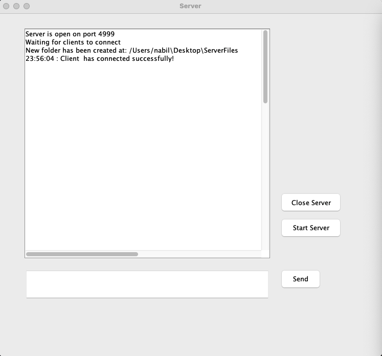
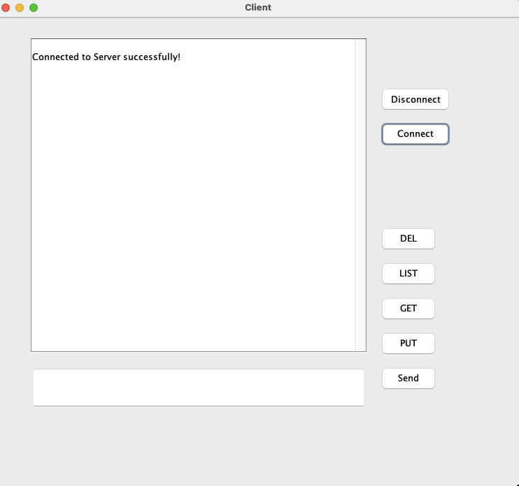
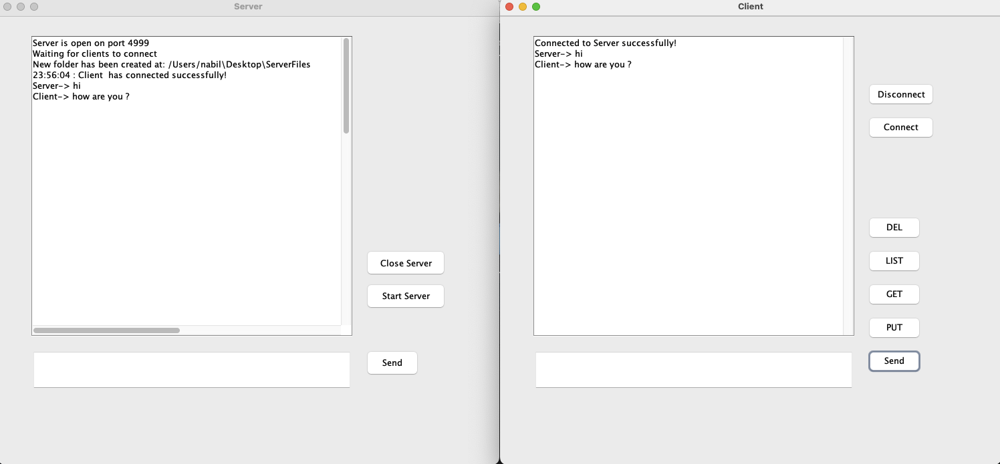

# A-Java-based-Server-Client-Network-File-Management-System

# Project Overview

This Java-based application is a comprehensive file management solution designed to streamline the process of managing files across a network. It utilizes a client-server architecture to enable users to connect, upload, download, list, and delete files with ease. The system also supports basic command acknowledgment and error handling mechanisms to ensure reliable operation.

# Key Features

* **Connectivity Management:** Establish and terminate connections seamlessly using simple commands (CON, DSC).
* **File Operations:** Perform essential file operations like uploading (PUT), downloading (GET), listing (LST), and deleting (DEL) with straightforward commands.
* **Data Transmission:** Efficiently encapsulate and transmit data across the network (DAT).
* **Acknowledgment Handling:** Receive immediate operation acknowledgments (ACK) and error notifications (DND) to ensure the integrity of transactions.

# How to Use

1. **Launch the Server:** Start the server application to listen for incoming connections.
2. **Connect as a Client:** Use the client application to connect to the server with the CON command.
3. **Perform File Operations:** Execute file operations using the respective commands (e.g., PUT <filename>, GET <filename>).
4. **Manage Connections:** Terminate the connection with the DSC command when done.

***

